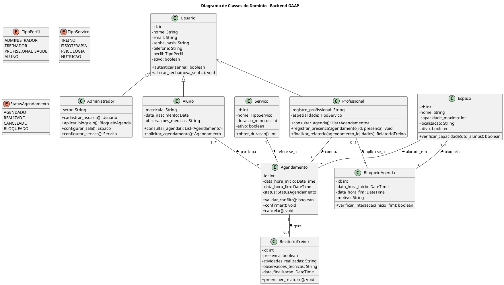

# Diagrama de Classes do Domínio — Backend GAAP

## 1. Descrição e Finalidade

O Diagrama de Classes representa a estrutura conceitual e orientada a objetos do sistema <b>GAAP (Gestão de Atletas de Alta Performance)</b>. Ele define as entidades fundamentais do domínio, seus atributos essenciais, métodos e os relacionamentos de associação, agregação e herança que fundamentam a modelagem do banco de dados relacional e a camada de persistência com o Django ORM.

### Fontes de Entrada
* **Levantamento de Requisitos**: Requisitos funcionais (RF-01 a RF-19) e regras de negócio (RN-01 a RN-06).
* **Casos de Uso**: Atores, fluxos principais e alternativos de agendamento e finalização de relatório.
* **Protótipo de Baixa Fidelidade**: Entidades e atributos manipulados nas interfaces operacionais.

---

## 2. Diagrama de Classes em PlantUML

---

## 3. Principais Entidades e Responsabilidades

| Classe | Descrição |
| :--- | :--- |
| **Usuario** | Entidade base com autenticação, perfis de acesso e dados cadastrais unificados. |
| **Administrador** | Herda de `Usuario`; gerencia cadastros de base, serviços, salas e bloqueios de agenda. |
| **Profissional** | Herda de `Usuario`; representa treinadores e profissionais de saúde vinculados a sua especialidade. |
| **Aluno** | Herda de `Usuario`; representa o atleta atendido nas sessões esportivas e clínicas. |
| **Servico** | Define as modalidades atendidas (*Treino, Fisioterapia, Psicologia, Nutrição*) e durações padrão. |
| **Espaco** *(Sala)* | Ambientes físicos com controle de capacidade máxima e disponibilidade. |
| **Agendamento** | Orquestra a sessão conectando Aluno, Profissional, Sala, Serviço e horário. |
| **BloqueioAgenda** | Registra períodos de indisponibilidade programada de profissionais ou ambientes. |
| **RelatorioTreino** | Registra confirmação de presença e observações técnicas pós-atendimento. |

---

## 4. Rastreabilidade das Classes Conceituais

| Classe Conceitual | Requisito(s) Relacionado(s) | Caso(s) de Uso | Tela / Protótipo |
| :--- | :--- | :--- | :--- |
| **Usuario** | RF-01, RF-02, RF-03 | UC-01 | Tela de Login |
| **Administrador** | RF-04, RF-05, RF-06, RF-07, RF-08 | UC-02, UC-03, UC-04, UC-05 | Painel do Administrador |
| **Profissional** | RF-05, RF-09, RF-15, RF-17, RF-18 | UC-03, UC-08, UC-09, UC-10 | Agenda do Profissional |
| **Aluno** | RF-04, RF-09, RF-11 | UC-02, UC-06, UC-08 | Gestão de Alunos |
| **Servico** | RF-06, RF-15 | UC-04, UC-06 | Agendamento de Sessão |
| **Espaco** *(Sala)* | RF-07, RF-11, RF-13 | UC-04, UC-06 | Agendamento de Sessão |
| **Agendamento** | RF-11, RF-12, RF-13, RF-14, RF-16 | UC-06, UC-07, UC-08 | Agendamento de Sessão / Agenda |
| **BloqueioAgenda** | RF-08, RF-14 | UC-05, UC-06 | Grade e Bloqueios |
| **RelatorioTreino** | RF-17, RF-18, RF-19 | UC-09, UC-10 | Finalizar Relatório |

---

## Autor(es)

| Data | Versão | Descrição | Autor(es) |
| :--- | :---: | :--- | :--- |
| 2026.2 | 1.0 | Versão inicial | Grupo 3 |
| 2026.2 | 2.0 | Reestruturação completa da modelagem OO para o Backend GAAP | Arthur Calebe, Antonio Reuther, Pedro Henrique Becker e Breno Huf |
| 2026.2 | 2.1 | Inclusão de Fontes de Entrada e Matriz de Rastreabilidade conforme modelo oficial | Arthur Calebe, Antonio Reuther, Pedro Henrique Becker e Breno Huf |
