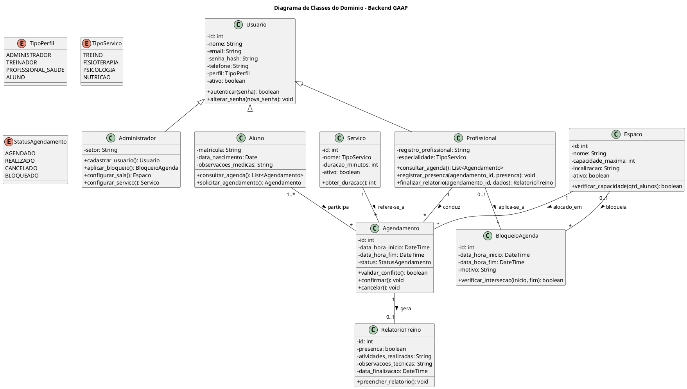

# Diagrama de Classes do Domínio — Backend GAAP

## 1. Descrição e Finalidade

O Diagrama de Classes representa a estrutura conceitual e orientada a objetos do sistema <b>GAAP (Gestão de Atletas de Alta Performance)</b>. Ele define as entidades fundamentais do domínio, seus atributos essenciais, métodos e os relacionamentos de associação, agregação e herança que fundamentam a modelagem do banco de dados relacional e a camada de persistência com o Django ORM.

---

## 2. Diagrama de Classes em PlantUML

---

## 3. Principais Entidades e Responsabilidades

| Classe | Descrição |
| :--- | :--- |
| **Usuario** | Entidade base com autenticação, perfis de acesso e dados cadastrais unificados. |
| **Administrador** | Herda de `Usuario`; gerencia cadastros de base, serviços, salas e bloqueios de agenda. |
| **Profissional** | Herda de `Usuario`; representa treinadores e profissionais de saúde vinculados a sua especialidade. |
| **Aluno** | Herda de `Usuario`; representa o atleta atendido nas sessões esportivas e clínicas. |
| **Servico** | Define as modalidades atendidas (*Treino, Fisioterapia, Psicologia, Nutrição*) e durações padrão. |
| **Espaco** *(Sala)* | Ambientes físicos com controle de capacidade máxima e disponibilidade. |
| **Agendamento** | Orquestra a sessão conectando Aluno, Profissional, Sala, Serviço e horário. |
| **BloqueioAgenda** | Registra períodos de indisponibilidade programada de profissionais ou ambientes. |
| **RelatorioTreino** | Registra confirmação de presença e observações técnicas pós-atendimento. |

---

## 4. Relacionamentos e Cardinalidades

* Um **Profissional** pode conduzir múltiplos **Agendamentos** (1 para N), mas não pode ter choque no mesmo horário.
* Um ou mais **Alunos** podem participar de um **Agendamento** (1..* para N), limitado pela capacidade do **Espaco**.
* Um **Espaco** pode receber múltiplos **Agendamentos** (1 para N) em horários distintos.
* Um **Agendamento** possui no máximo um **RelatorioTreino** (1 para 0..1), gerado após a realização da sessão.
* Um **BloqueioAgenda** pode ser associado especificamente a um **Profissional** ou a um **Espaco**.

---

## Autor(es)

| Data | Versão | Descrição | Autor(es) |
| :--- | :---: | :--- | :--- |
| 2026.2 | 1.0 | Versão inicial | Grupo 3 |
| 2026.2 | 2.0 | Reestruturação completa da modelagem OO para o Backend GAAP | Arthur Calebe, Antonio Reuter, Pedro Henrique Becker e Breno Huf |
