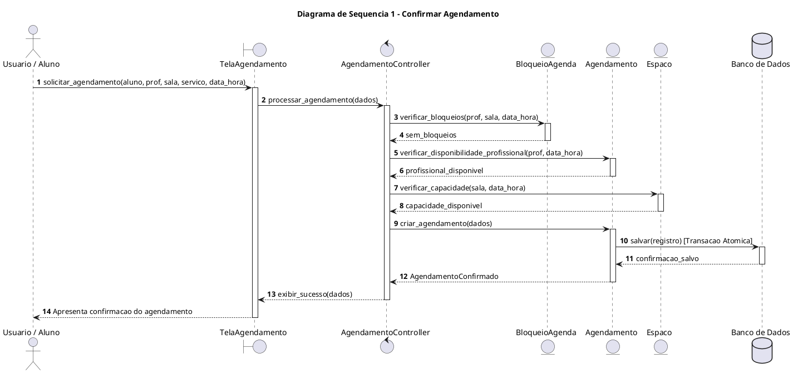
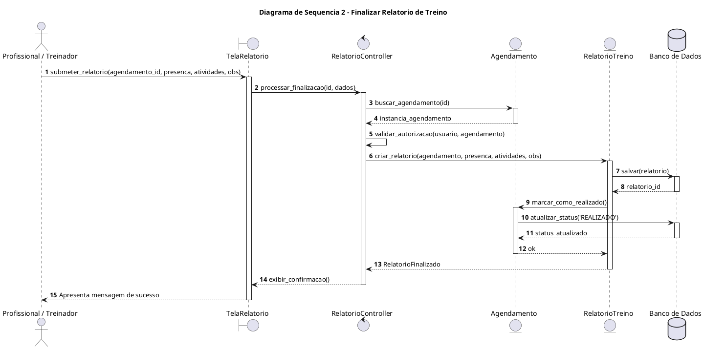

# Diagramas de Sequência — Backend GAAP

## Introdução

O Diagrama de Sequência é uma representação visual que demonstra a colaboração dinâmica entre os atores, as interfaces (Boundary), a camada de controle (Control) e as entidades do domínio (Entity) ao longo do tempo. O modelo adotado segue o padrão estabelecido na disciplina, garantindo rastreabilidade direta com os Casos de Uso, Requisitos Funcionais, Regras de Negócio e o Protótipo para os dois fluxos essenciais do sistema <b>GAAP</b>:

1. **Caso 1: Confirmar Agendamento de Sessão** (Validação de capacidade, conflito e bloqueio).
2. **Caso 2: Finalizar Relatório de Treino** (Validação de permissão, presença e persistência).

---

## Diagrama de Sequência 1 — Confirmar Agendamento

### 1. Identificação
* **Caso de Uso**: Confirmar Agendamento de Sessão
* **ID do Caso de Uso**: UC-06
* **Ator(es)**: Aluno / Responsável, Administrador
* **Prioridade**: Alta (Must)
* **Responsável**: Arthur Calebe e Antonio Reuther
* **Data**: 2026.2

### 2. Referências
* **Requisitos Relacionados**: RF-11, RF-12, RF-13, RF-14, RF-15
* **Caso de Uso**: [UC-06 — Confirmar Agendamento](casos_de_uso.md#uc-06--confirmar-agendamento-de-sessao-caso-critico)
* **Protótipo de Baixa Fidelidade**: Tela de Agendamento de Sessão
* **Regras de Negócio Associadas**: RN-01 (Sem conflito de horário), RN-02 (Capacidade da sala), RN-03 (Respeito a bloqueios), RN-04 (Especialidade do serviço)

### 3. Cenário Modelado
* **Objetivo do Cenário**: Realizar a reserva de uma sessão com validação atômica simultânea de disponibilidade.
* **Pré-condições**: Aluno, profissional, sala e serviço cadastrados; usuário autenticado.
* **Pós-condições**: Agendamento persistido no banco com status `AGENDADO` e vaga confirmada.
* **Gatilho de Início**: Usuário confirma a solicitação de agendamento na interface do sistema.

### 4. Participantes (Lifelines)
* **Ator**: `Usuario / Aluno`
* **Boundary (Interface/Tela)**: `TelaAgendamento`
* **Control (Controlador)**: `AgendamentoController`
* **Entity (Domínio/Serviços)**: `BloqueioAgenda`, `Espaco`, `Agendamento`
* **Database**: `Banco de Dados`

### 5. Fluxo Principal de Mensagens

| Passo | Remetente | Destinatário | Mensagem / Ação | Tipo |
| :---: | :--- | :--- | :--- | :--- |
| **1** | Usuario | TelaAgendamento | `solicitar_agendamento(aluno, prof, sala, servico, data_hora)` | Síncrono |
| **2** | TelaAgendamento | AgendamentoController | `processar_agendamento(dados)` | Síncrono |
| **3** | AgendamentoController | BloqueioAgenda | `verificar_bloqueios(prof, sala, data_hora)` | Síncrono |
| **4** | BloqueioAgenda | AgendamentoController | Retorna: `sem_bloqueios` | Retorno |
| **5** | AgendamentoController | Agendamento | `verificar_disponibilidade_profissional(prof, data_hora)` | Síncrono |
| **6** | Agendamento | AgendamentoController | Retorna: `profissional_disponivel` | Retorno |
| **7** | AgendamentoController | Espaco | `verificar_capacidade(sala, data_hora)` | Síncrono |
| **8** | Espaco | AgendamentoController | Retorna: `capacidade_disponivel` | Retorno |
| **9** | AgendamentoController | Agendamento | `criar_agendamento(dados)` | Síncrono |
| **10**| Agendamento | Banco de Dados | `salvar(registro) [Transação Atômica]` | Síncrono |
| **11**| Banco de Dados | Agendamento | Retorna: `confirmacao_salvo` | Retorno |
| **12**| Agendamento | AgendamentoController | Retorna: `AgendamentoConfirmado` | Retorno |
| **13**| AgendamentoController | TelaAgendamento | Retorna: `exibir_sucesso(dados)` | Retorno |
| **14**| TelaAgendamento | Usuario | `Apresenta confirmação do agendamento` | Retorno |

### 6. Fluxos Alternativos e Exceções

| ID | Condição | Descrição do Fluxo | Impacto |
| :--- | :--- | :--- | :--- |
| **A1** | Profissional ocupado | Sistema detecta agendamento concorrente no mesmo horário | Notifica indisponibilidade e sugere horários alternativos. |
| **A2** | Sala com capacidade esgotada | Lotação máxima atingida para o horário solicitado | Impede reserva e informa que a sala está lotada. |
| **E1** | Bloqueio de agenda ativo | Existe bloqueio administrativo cadastrado no período | Notifica indisponibilidade do espaço/profissional por motivo administrativo. |

### 7. Regras de Negócio Aplicadas
* **RN-01**: Sem choque de horário para profissional ou sala.
* **RN-02**: Somatório de atletas não pode ultrapassar a capacidade da sala.
* **RN-03**: Bloqueios administrativos sobrepõem qualquer agendamento.
* **RN-04**: Profissional deve possuir a especialidade requerida pelo serviço.

### 8. Pontos de Validação
- [x] Fluxo compatível com o Caso de Uso UC-06.
- [x] Mensagens consistentes com os requisitos funcionais RF-11 a RF-15.
- [x] Alternativas de conflito e exceções representadas.
- [x] Participantes aderentes à arquitetura Model-View-Controller do Django.
- [x] Correspondência com a tela de agendamento do protótipo.

### 9. Diagrama PlantUML

---

## Diagrama de Sequência 2 — Finalizar Relatório de Treino

### 1. Identificação
* **Caso de Uso**: Finalizar Relatório de Treino
* **ID do Caso de Uso**: UC-10
* **Ator(es)**: Treinador, Profissional de Saúde, Administrador
* **Prioridade**: Alta (Must)
* **Responsável**: Pedro Henrique Becker e Breno Huf
* **Data**: 2026.2

### 2. Referências
* **Requisitos Relacionados**: RF-17, RF-18, RF-19
* **Caso de Uso**: [UC-10 — Finalizar Relatório](casos_de_uso.md#uc-10--finalizar-relatorio-de-treino-caso-critico)
* **Protótipo de Baixa Fidelidade**: Tela de Finalizar Relatório
* **Regras de Negócio Associadas**: RN-05 (Autoria de registro), RN-06 (Imutabilidade pós-finalização)

### 3. Cenário Modelado
* **Objetivo do Cenário**: Registrar a presença ou falta do aluno e consolidar o relatório técnico de atividades e observações.
* **Pré-condições**: Sessão previamente agendada e concluída; profissional autenticado e vinculado à sessão.
* **Pós-condições**: Presença gravada, relatório persistido e agendamento atualizado para status `REALIZADO`.
* **Gatilho de Início**: Profissional submete o relatório de treino na interface do sistema.

### 4. Participantes (Lifelines)
* **Ator**: `Profissional / Treinador`
* **Boundary (Interface/Tela)**: `TelaRelatorio`
* **Control (Controlador)**: `RelatorioController`
* **Entity (Domínio/Serviços)**: `Agendamento`, `RelatorioTreino`
* **Database**: `Banco de Dados`

### 5. Fluxo Principal de Mensagens

| Passo | Remetente | Destinatário | Mensagem / Ação | Tipo |
| :---: | :--- | :--- | :--- | :--- |
| **1** | Profissional | TelaRelatorio | `submeter_relatorio(agendamento_id, presenca, atividades, obs)` | Síncrono |
| **2** | TelaRelatorio | RelatorioController | `processar_finalizacao(id, dados)` | Síncrono |
| **3** | RelatorioController | Agendamento | `buscar_agendamento(id)` | Síncrono |
| **4** | Agendamento | RelatorioController | Retorna: `instancia_agendamento` | Retorno |
| **5** | RelatorioController | RelatorioController | `validar_autorizacao(usuario, agendamento)` | Interno |
| **6** | RelatorioController | RelatorioTreino | `criar_relatorio(agendamento, presenca, atividades, obs)` | Síncrono |
| **7** | RelatorioTreino | Banco de Dados | `salvar(relatorio)` | Síncrono |
| **8** | Banco de Dados | RelatorioTreino | Retorna: `relatorio_id` | Retorno |
| **9** | RelatorioTreino | Agendamento | `marcar_como_realizado()` | Síncrono |
| **10**| Agendamento | Banco de Dados | `atualizar_status('REALIZADO')` | Síncrono |
| **11**| Banco de Dados | Agendamento | Retorna: `status_atualizado` | Retorno |
| **12**| Agendamento | RelatorioTreino | Retorna: `ok` | Retorno |
| **13**| RelatorioTreino | RelatorioController | Retorna: `RelatorioFinalizado` | Retorno |
| **14**| RelatorioController | TelaRelatorio | Retorna: `exibir_confirmacao()` | Retorno |
| **15**| TelaRelatorio | Profissional | `Apresenta mensagem de sucesso` | Retorno |

### 6. Fluxos Alternativos e Exceções

| ID | Condição | Descrição do Fluxo | Impacto |
| :--- | :--- | :--- | :--- |
| **A1** | Profissional não autorizado | Usuário tentando registrar relatório não é o profissional vinculado nem administrador | Exibe mensagem de permissão negada e bloqueia a operação. |
| **E1** | Sessão já finalizada | Relatório já havia sido finalizado anteriormente | Informa que o relatório está bloqueado para edição (RN-06). |

### 7. Regras de Negócio Aplicadas
* **RN-05**: Apenas o profissional atribuído ou o administrador pode registrar presença e observações.
* **RN-06**: Relatórios finalizados tornam-se imutáveis para garantia de auditoria técnica.

### 8. Pontos de Validação
- [x] Fluxo compatível com o Caso de Uso UC-10.
- [x] Mensagens consistentes com os requisitos funcionais RF-17 e RF-18.
- [x] Alternativas de permissão e imutabilidade representadas.
- [x] Participantes aderentes à arquitetura Model-View-Controller do Django.
- [x] Correspondência com a tela de relatório do protótipo.

### 9. Diagrama PlantUML

---

## Autor(es)

| Data | Versão | Descrição | Autor(es) |
| :--- | :---: | :--- | :--- |
| 2026.2 | 1.0 | Versão inicial | Grupo 3 |
| 2026.2 | 2.0 | Elaboração dos diagramas oficiais do Backend GAAP | Arthur Calebe, Antonio Reuther, Pedro Henrique Becker e Breno Huf |
| 2026.2 | 2.1 | Preenchimento completo das fichas técnicas e tabelas de fluxo | Arthur Calebe, Antonio Reuther, Pedro Henrique Becker e Breno Huf |
| 2026.2 | 2.2 | Alinhamento da notação para o padrão Boundary-Control-Entity do modelo da disciplina | Arthur Calebe, Antonio Reuther, Pedro Henrique Becker e Breno Huf |
