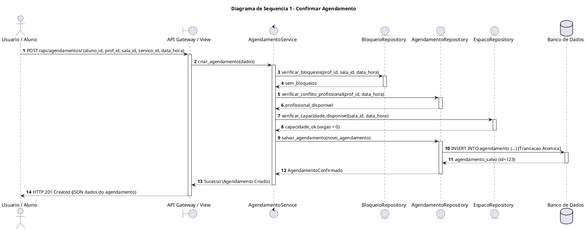
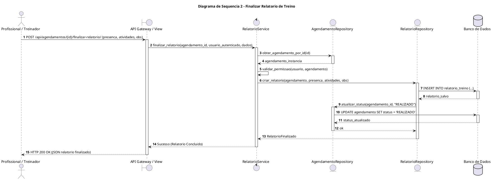

# Diagramas de Sequência — Backend GAAP

## Introdução

O Diagrama de Sequência é uma representação visual que demonstra a interação dinâmica entre objetos e componentes ao longo do tempo. Este documento adota o padrão formal estabelecido na disciplina, garantindo a rastreabilidade direta com os Casos de Uso, Requisitos Funcionais, Regras de Negócio e Telas do Protótipo para os dois cenários mais críticos do sistema <b>GAAP</b>:

1. **Caso 1: Confirmar Agendamento de Sessão** (Validação de capacidade, conflito e bloqueio).
2. **Caso 2: Finalizar Relatório de Treino** (Validação de permissão, presença e persistência).

---

## Diagrama de Sequência 1 — Confirmar Agendamento

### 1. Identificação
* **Caso de Uso**: Confirmar Agendamento de Sessão
* **ID do Caso de Uso**: UC-06
* **Ator(es)**: Aluno / Responsável, Administrador
* **Prioridade**: Alta (Must)
* **Responsável**: Arthur Calebe e Antonio Reuter
* **Data**: 2026.2

### 2. Referências
* **Requisitos Relacionados**: RF-11, RF-12, RF-13, RF-14, RF-15
* **Caso de Uso**: [UC-06 — Confirmar Agendamento](casos_de_uso.md#uc-06--confirmar-agendamento-de-sessao-caso-critico)
* **Protótipo de Baixa Fidelidade**: Tela de Agendamento de Sessão
* **Regras de Negócio Associadas**: RN-01 (Sem conflito de horário), RN-02 (Capacidade da sala), RN-03 (Respeito a bloqueios), RN-04 (Especialidade do serviço)

### 3. Cenário Modelado
* **Objetivo do Cenário**: Realizar a reserva de uma sessão com validação atômica simultânea de disponibilidade.
* **Pré-condições**: Aluno, profissional, sala e serviço cadastrados; usuário autenticado.
* **Pós-condições**: Agendamento persistido no banco com status `AGENDADO` e vaga decrementada.
* **Gatilho de Início**: Usuário submete o formulário de novo agendamento via API (`POST /api/agendamentos/`).

### 4. Participantes (Lifelines)
* **Ator**: `Usuario / Aluno`
* **Boundary**: `API Gateway / View (AgendamentoView)`
* **Control**: `AgendamentoService`
* **Entity / Repository**: `BloqueioRepository`, `AgendamentoRepository`, `EspacoRepository`
* **Database**: `Banco de Dados Relacional`

### 5. Fluxo Principal de Mensagens

| Passo | Remetente | Destinatário | Mensagem / Ação | Tipo |
| :---: | :--- | :--- | :--- | :--- |
| **1** | Usuario | API | `POST /api/agendamentos/ (aluno, prof, sala, servico, data_hora)` | Síncrono |
| **2** | API | AgendamentoService | `criar_agendamento(dados)` | Síncrono |
| **3** | AgendamentoService | BloqueioRepository | `verificar_bloqueios(prof_id, sala_id, data_hora)` | Síncrono |
| **4** | BloqueioRepository | AgendamentoService | Retorna: `sem_bloqueios` | Retorno |
| **5** | AgendamentoService | AgendamentoRepository | `verificar_conflito_profissional(prof_id, data_hora)` | Síncrono |
| **6** | AgendamentoRepository | AgendamentoService | Retorna: `profissional_disponivel` | Retorno |
| **7** | AgendamentoService | EspacoRepository | `verificar_capacidade_disponivel(sala_id, data_hora)` | Síncrono |
| **8** | EspacoRepository | AgendamentoService | Retorna: `capacidade_ok (vagas > 0)` | Retorno |
| **9** | AgendamentoService | AgendamentoRepository | `salvar_agendamento(novo_agendamento)` | Síncrono |
| **10**| AgendamentoRepository | Banco de Dados | `INSERT INTO agendamento (...) [Transação Atômica]` | Síncrono |
| **11**| Banco de Dados | AgendamentoRepository | Retorna: `agendamento_id` | Retorno |
| **12**| AgendamentoRepository | AgendamentoService | Retorna: `AgendamentoConfirmado` | Retorno |
| **13**| AgendamentoService | API | Retorna: `Sucesso` | Retorno |
| **14**| API | Usuario | `HTTP 201 Created (JSON dados do agendamento)` | Retorno |

### 6. Fluxos Alternativos e Exceções

| ID | Condição | Descrição do Fluxo | Impacto |
| :--- | :--- | :--- | :--- |
| **A1** | Profissional ocupado | Repositório detecta agendamento concorrente no mesmo horário | Retorna `HTTP 409 Conflict`, impede reserva e sugere outros horários. |
| **A2** | Sala com capacidade esgotada | Lotação máxima atingida para o horário solicitado | Retorna `HTTP 422 Unprocessable Entity`, informando sala cheia. |
| **E1** | Bloqueio de agenda ativo | Existe bloqueio administrativo cadastrado no período | Retorna `HTTP 403 Forbidden`, informando indisponibilidade do espaço/profissional. |

### 7. Regras de Negócio Aplicadas
* **RN-01**: Sem choque de horário para profissional ou sala.
* **RN-02**: Somatório de atletas não pode ultrapassar capacidade da sala.
* **RN-03**: Bloqueios administrativos sobrepõem qualquer agendamento.
* **RN-04**: Profissional deve ter a especialidade requerida pelo serviço.

### 8. Pontos de Validação
- [x] Fluxo compatível com o Caso de Uso UC-06.
- [x] Mensagens consistentes com os requisitos funcionais RF-11 a RF-15.
- [x] Alternativas de conflito e exceções representadas.
- [x] Participantes aderentes à arquitetura em camadas do Django.
- [x] Correspondência com a tela de agendamento do protótipo.

### 9. Diagrama PlantUML

---

## Diagrama de Sequência 2 — Finalizar Relatório de Treino

### 1. Identificação
* **Caso de Uso**: Finalizar Relatório de Treino
* **ID do Caso de Uso**: UC-10
* **Ator(es)**: Treinador, Profissional de Saúde, Administrador
* **Prioridade**: Alta (Must)
* **Responsável**: Pedro Henrique Becker e Breno Huf
* **Data**: 2026.2

### 2. Referências
* **Requisitos Relacionados**: RF-17, RF-18, RF-19
* **Caso de Uso**: [UC-10 — Finalizar Relatório](casos_de_uso.md#uc-10--finalizar-relatorio-de-treino-caso-critico)
* **Protótipo de Baixa Fidelidade**: Tela de Finalizar Relatório
* **Regras de Negócio Associadas**: RN-05 (Autoria de registro), RN-06 (Imutabilidade pós-finalização)

### 3. Cenário Modelado
* **Objetivo do Cenário**: Registrar a presença ou falta do aluno e consolidar o relatório técnico de atividades e observações.
* **Pré-condições**: Sessão previamente agendada e concluída; profissional autenticado e vinculado à sessão.
* **Pós-condições**: Presença gravada, relatório persistido e agendamento atualizado para status `REALIZADO`.
* **Gatilho de Início**: Profissional submete o relatório via API (`POST /api/agendamentos/{id}/finalizar-relatorio/`).

### 4. Participantes (Lifelines)
* **Ator**: `Profissional / Treinador`
* **Boundary**: `API Gateway / View (RelatorioView)`
* **Control**: `RelatorioService`
* **Entity / Repository**: `AgendamentoRepository`, `RelatorioRepository`
* **Database**: `Banco de Dados Relacional`

### 5. Fluxo Principal de Mensagens

| Passo | Remetente | Destinatário | Mensagem / Ação | Tipo |
| :---: | :--- | :--- | :--- | :--- |
| **1** | Profissional | API | `POST /api/agendamentos/{id}/finalizar-relatorio/ (presenca, atividades, obs)` | Síncrono |
| **2** | API | RelatorioService | `finalizar_relatorio(id, usuario_autenticado, dados)` | Síncrono |
| **3** | RelatorioService | AgendamentoRepository | `obter_agendamento_por_id(id)` | Síncrono |
| **4** | AgendamentoRepository | RelatorioService | Retorna: `agendamento_instancia` | Retorno |
| **5** | RelatorioService | RelatorioService | `validar_permissao(usuario, agendamento)` | Interno |
| **6** | RelatorioService | RelatorioRepository | `criar_relatorio(agendamento, presenca, atividades, obs)` | Síncrono |
| **7** | RelatorioRepository | Banco de Dados | `INSERT INTO relatorio_treino (...)` | Síncrono |
| **8** | Banco de Dados | RelatorioRepository | Retorna: `relatorio_id` | Retorno |
| **9** | RelatorioRepository | AgendamentoRepository | `atualizar_status(agendamento_id, 'REALIZADO')` | Síncrono |
| **10**| AgendamentoRepository | Banco de Dados | `UPDATE agendamento SET status = 'REALIZADO'` | Síncrono |
| **11**| Banco de Dados | AgendamentoRepository | Retorna: `status_atualizado` | Retorno |
| **12**| AgendamentoRepository | RelatorioRepository | Retorna: `ok` | Retorno |
| **13**| RelatorioRepository | RelatorioService | Retorna: `RelatorioFinalizado` | Retorno |
| **14**| RelatorioService | API | Retorna: `Sucesso` | Retorno |
| **15**| API | Profissional | `HTTP 200 OK (JSON relatório finalizado)` | Retorno |

### 6. Fluxos Alternativos e Exceções

| ID | Condição | Descrição do Fluxo | Impacto |
| :--- | :--- | :--- | :--- |
| **A1** | Profissional não autorizado | Usuário tentando registrar relatório não é o profissional vinculado nem administrador | Retorna `HTTP 403 Forbidden`, bloqueia a operação. |
| **E1** | Sessão já finalizada | Relatório já havia sido finalizado anteriormente | Retorna `HTTP 400 Bad Request` conforme RN-06 (imutabilidade). |

### 7. Regras de Negócio Aplicadas
* **RN-05**: Apenas o profissional atribuído ou o administrador pode registrar presença e observações.
* **RN-06**: Relatórios finalizados tornam-se imutáveis para garantia de auditoria técnica.

### 8. Pontos de Validação
- [x] Fluxo compatível com o Caso de Uso UC-10.
- [x] Mensagens consistentes com os requisitos funcionais RF-17 e RF-18.
- [x] Alternativas de permissão e imutabilidade representadas.
- [x] Participantes aderentes à arquitetura em camadas do Django.
- [x] Correspondência com a tela de relatório do protótipo.

### 9. Diagrama PlantUML

---

## Autor(es)

| Data | Versão | Descrição | Autor(es) |
| :--- | :---: | :--- | :--- |
| 2026.2 | 1.0 | Versão inicial | Grupo 3 |
| 2026.2 | 2.0 | Elaboração dos diagramas oficiais do Backend GAAP | Arthur Calebe, Antonio Reuter, Pedro Henrique Becker e Breno Huf |
| 2026.2 | 2.1 | Preenchimento completo das fichas técnicas e tabelas de fluxo conforme padrão oficial | Arthur Calebe, Antonio Reuter, Pedro Henrique Becker e Breno Huf |
