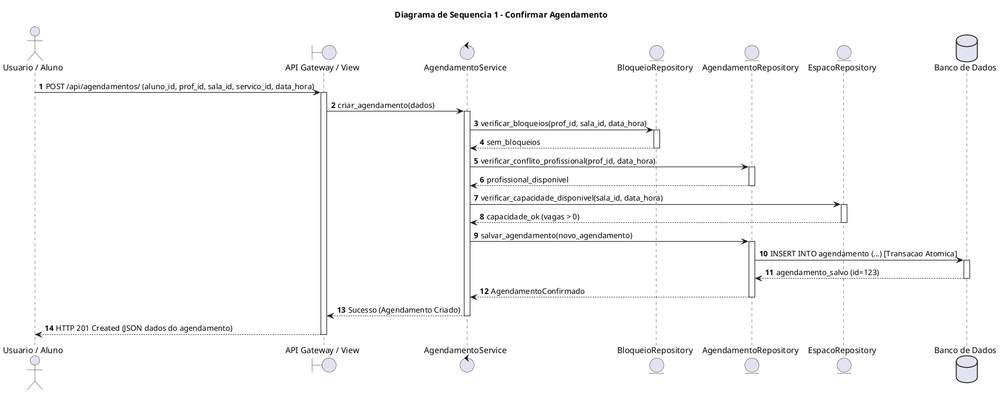
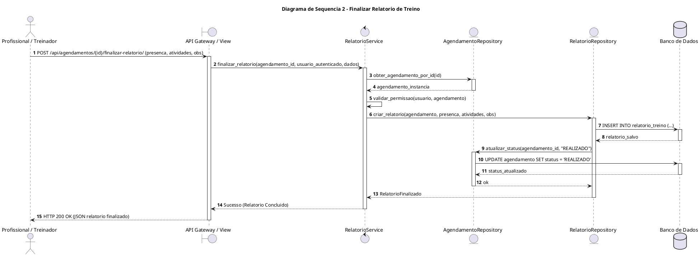

# Diagramas de Sequência — Backend GAAP

## Introdução

Os Diagramas de Sequência modelam o comportamento dinâmico e a troca de mensagens entre os atores, controladores, serviços de domínio e a camada de persistência para os dois fluxos mais críticos do sistema <b>GAAP</b> exigidos no escopo da disciplina:

1. **Caso 1: Confirmar Agendamento de Sessão** (Validação de conflitos, bloqueios e capacidade).
2. **Caso 2: Finalizar Relatório de Treino** (Validação de autoria, registro de presença e encerramento).

---

## 1. Diagrama de Sequência 1 — Confirmar Agendamento

### Descrição do Fluxo
O usuário solicita a marcação de uma sessão. O controlador de agendamento valida simultaneamente:
1. Se o profissional possui especialidade para o serviço.
2. Se o profissional já possui outro agendamento no horário (*double-booking*).
3. Se a sala possui bloqueio ativo ou se excederá a capacidade máxima.
4. Se o aluno não possui outro agendamento simultâneo.
Sendo todas as condições válidas, a sessão é persistida atomicamente.

---

## 2. Diagrama de Sequência 2 — Finalizar Relatório de Treino

### Descrição do Fluxo
O Treinador ou Profissional de Saúde acessa a sessão realizada, informa a presença/falta do aluno, descreve as atividades e observações técnicas e finaliza o relatório de treino.

---

## 3. Conclusão

Os diagramas de sequência detalham o ciclo de validações e persistência transacional dos dois fluxos nucleares do GAAP, garantindo aderência estrita aos critérios de aceitação e aos requisitos não funcionais de integridade e segurança.

## Autor(es)

| Data | Versão | Descrição | Autor(es) |
| :--- | :---: | :--- | :--- |
| 2026.2 | 1.0 | Versão inicial | Grupo 3 |
| 2026.2 | 2.0 | Elaboração dos diagramas oficiais do Backend GAAP (Confirmar Agendamento e Finalizar Relatório) | Arthur Calebe, Antonio Reuter, Pedro Henrique Becker e Breno Huf |
