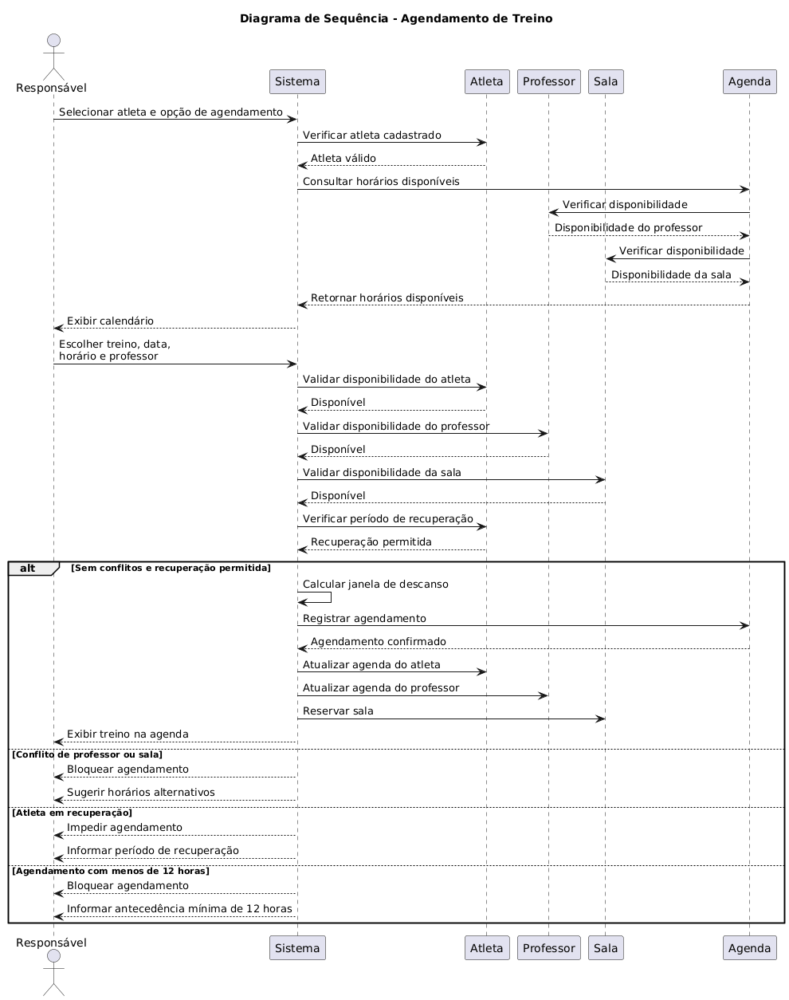

# Diagrama de Sequência — Agendamento de Treino

## Descrição

O diagrama de sequência representa o fluxo de **agendamento de um treino** no Sistema de Gestão de Treinos.

O processo começa quando o **Responsável** seleciona um atleta e solicita um novo agendamento. O sistema verifica a existência do atleta e, em seguida, consulta a disponibilidade de horários, professor e sala.

Após a escolha do treino, data, horário e professor, o sistema realiza novas validações para garantir que não existam conflitos e que o atleta não esteja em período de recuperação.

Caso todas as condições sejam atendidas, o sistema registra o agendamento e atualiza as agendas envolvidas.

---

## Diagrama

<!-- Insira a imagem do diagrama abaixo -->

---

## Participantes

| Participante    | Descrição                                                              |
| --------------- | ---------------------------------------------------------------------- |
| **Responsável** | Usuário responsável por realizar o agendamento do treino.              |
| **Sistema**     | Responsável por coordenar o processo e realizar as validações.         |
| **Atleta**      | Atleta que realizará o treino e cuja disponibilidade é verificada.     |
| **Professor**   | Professor responsável pelo treino e cuja disponibilidade é consultada. |
| **Sala**        | Espaço onde o treino será realizado.                                   |
| **Agenda**      | Responsável por consultar e registrar os horários dos agendamentos.    |

---

## Fluxo Principal

1. O Responsável seleciona o atleta e a opção de agendamento.
2. O Sistema verifica se o atleta está cadastrado.
3. O Sistema consulta os horários disponíveis.
4. A disponibilidade do professor e da sala é verificada.
5. O Sistema apresenta o calendário ao Responsável.
6. O Responsável escolhe o treino, data, horário e professor.
7. O Sistema valida novamente a disponibilidade do atleta, professor e sala.
8. O Sistema verifica o período de recuperação do atleta.
9. O Sistema calcula a janela de descanso.
10. O agendamento é registrado.
11. As agendas do atleta e do professor são atualizadas.
12. A sala é reservada.
13. O treino é exibido na agenda.

---

## Fluxos Alternativos

### Conflito de Professor ou Sala

Caso exista conflito de horário com o professor ou com a sala, o sistema:

* Bloqueia o agendamento.
* Sugere horários alternativos.

### Atleta em Recuperação

Caso o atleta esteja em período de recuperação, o sistema:

* Impede o agendamento.
* Informa o período de recuperação ao Responsável.

### Antecedência Inferior a 12 Horas

Caso o agendamento seja solicitado com menos de **12 horas de antecedência**, o sistema:

* Bloqueia o agendamento.
* Informa ao Responsável sobre a antecedência mínima necessária.

---

## Regras de Negócio

O agendamento somente pode ser confirmado quando:

* O atleta estiver cadastrado.
* O atleta estiver disponível.
* O professor estiver disponível.
* A sala estiver disponível.
* O atleta não estiver em período de recuperação.
* Não houver conflitos de horário.
* O agendamento respeitar a antecedência mínima de 12 horas.

Caso alguma dessas condições não seja atendida, o sistema deverá impedir o agendamento e informar o motivo ao Responsável.
