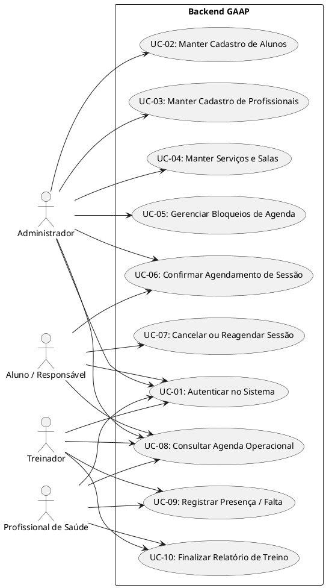

# Especificação de Casos de Uso — Backend GAAP

## 1. Diagrama Geral de Casos de Uso

---

## 2. Detalhamento dos Casos de Uso Prioritários

### UC-01 — Autenticar no Sistema
* **Atores**: Administrador, Treinador, Profissional de Saúde, Aluno.
* **Pré-condições**: Usuário cadastrado e ativo.
* **Fluxo Principal**:
  1. Usuário informa e-mail e senha.
  2. Sistema valida as credenciais contra o hash criptográfico.
  3. Sistema identifica o perfil do usuário e gera o token de sessão.
  4. Usuário acessa as rotas autorizadas para o seu perfil.
* **Fluxos Alternativos**:
  * *2a. Credenciais inválidas*: Sistema recusa o acesso e informa erro.

---

### UC-02 — Manter Cadastro de Alunos
* **Atores**: Administrador.
* **Pré-condições**: Administrador autenticado.
* **Fluxo Principal**:
  1. Administrador solicita cadastro de novo aluno com nome, e-mail, telefone e observações.
  2. Sistema valida os campos obrigatórios e unicidade do e-mail.
  3. Sistema persiste o registro no banco de dados.
* **Fluxos Alternativos**:
  * *2a. E-mail já existente*: Sistema recusa e informa duplicidade.

---

### UC-03 — Manter Cadastro de Profissionais
* **Atores**: Administrador.
* **Pré-condições**: Administrador autenticado.
* **Fluxo Principal**:
  1. Administrador cadastra profissional informando dados pessoais e especialidade (*Treinador, Fisioterapeuta, Nutricionista, Psicólogo*).
  2. Sistema valida e associa o perfil ao profissional.
  3. Sistema disponibiliza o profissional para alocação na grade de horários.

---

### UC-04 — Manter Serviços e Salas
* **Atores**: Administrador.
* **Pré-condições**: Administrador autenticado.
* **Fluxo Principal**:
  1. Administrador cadastra/edita salas (com capacidade máxima) e serviços (*Treino, Fisioterapia, Psicologia, Nutrição*).
  2. Sistema persiste as configurações para uso na validação de agenda.

---

### UC-05 — Gerenciar Bloqueios de Agenda
* **Atores**: Administrador.
* **Pré-condições**: Administrador autenticado.
* **Fluxo Principal**:
  1. Administrador seleciona profissional ou sala e define período de bloqueio (início, fim e justificativa).
  2. Sistema registra o bloqueio e impede novas reservas no intervalo especificado.

---

### UC-06 — Confirmar Agendamento de Sessão *(Caso Crítico)*
* **Atores**: Aluno/Responsável, Administrador, Sistema.
* **Pré-condições**: Aluno, profissional, sala e serviço cadastrados; usuário autenticado.
* **Fluxo Principal**:
  1. Usuário seleciona o Aluno, o Serviço (*Treino, Fisio, Psico, Nutri*), o Profissional, a Sala e o Horário desejado.
  2. Sistema verifica a especialidade do profissional com o serviço solicitado (RN-04).
  3. Sistema verifica se o profissional já possui outro agendamento no horário (RN-01).
  4. Sistema verifica se a sala possui bloqueio ativo ou se excederá a capacidade máxima (RN-02, RN-03).
  5. Sistema valida se o aluno não possui agendamento simultâneo.
  6. Sistema registra a sessão como confirmada de forma atômica e atualiza a agenda.
* **Fluxos Alternativos**:
  * *3a. Conflito de profissional*: Sistema bloqueia e notifica que o profissional está ocupado.
  * *4a. Sala lotada ou bloqueada*: Sistema bloqueia a reserva e sugere outro horário/espaço.

---

### UC-07 — Cancelar ou Reagendar Sessão
* **Atores**: Aluno/Responsável, Administrador.
* **Pré-condições**: Sessão previamente agendada.
* **Fluxo Principal**:
  1. Usuário solicita o cancelamento ou novo horário para a sessão.
  2. Sistema atualiza o status do agendamento e libera a vaga imediatamente na agenda.

---

### UC-08 — Consultar Agenda Operacional
* **Atores**: Administrador, Treinador, Profissional de Saúde, Aluno.
* **Pré-condições**: Usuário autenticado.
* **Fluxo Principal**:
  1. Usuário aplica filtros (data, serviço, profissional, sala).
  2. Sistema retorna a grade horária respeitando o nível de visibilidade de cada perfil.

---

### UC-09 — Registrar Presença / Falta
* **Atores**: Treinador, Profissional de Saúde, Administrador.
* **Pré-condições**: Sessão agendada na data corrente ou pretérita.
* **Fluxo Principal**:
  1. Profissional acessa a sessão sob sua responsabilidade.
  2. Profissional marca o status do aluno como Presente ou Ausente.
  3. Sistema atualiza o registro da sessão.

---

### UC-10 — Finalizar Relatório de Treino *(Caso Crítico)*
* **Atores**: Treinador, Profissional de Saúde, Administrador.
* **Pré-condições**: Sessão realizada e presença confirmada.
* **Fluxo Principal**:
  1. Profissional seleciona a sessão realizada.
  2. Profissional preenche as atividades executadas, observações técnicas e recomendações.
  3. Sistema valida os campos obrigatórios e finaliza o relatório de treino.
  4. Sistema bloqueia edições futuras e disponibiliza o histórico para consulta.

---

## 3. Conclusão

Os casos de uso cobrem a totalidade dos fluxos operacionais previstos no MVP do Backend GAAP, garantindo o suporte às validações de capacidade, bloqueios e registro pós-sessão exigidos pela disciplina.

## Autor(es)

| Data | Versão | Descrição | Autor(es) |
| :--- | :---: | :--- | :--- |
| 2026.2 | 1.0 | Criação inicial | Pedro Henrique Becker |
| 2026.2 | 2.0 | Reestruturação completa dos Casos de Uso com base no cenário GAAP | Arthur Calebe, Antonio Reuter, Pedro Henrique Becker e Breno Huf |
