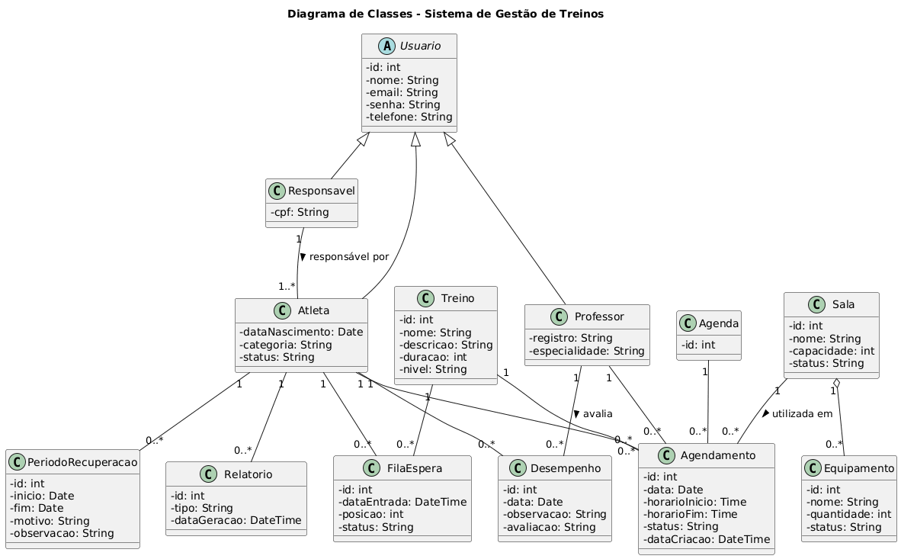

# Diagrama de Classes — Sistema de Gestão de Treinos

## Descrição

O diagrama de classes representa a estrutura do **Sistema de Gestão de Treinos**, apresentando as principais classes do sistema, seus atributos e os relacionamentos existentes entre elas.

O modelo contempla o gerenciamento de responsáveis, atletas e professores, além de treinos, agendamentos, salas, equipamentos, agendas, períodos de recuperação, fila de espera e registros de desempenho.

---

## Diagrama

<!-- Insira a imagem do diagrama abaixo -->



---

## Principais Classes

| Classe                 | Descrição                                                                 |
| ---------------------- | ------------------------------------------------------------------------- |
| **Usuario**            | Classe base para os usuários do sistema.                                  |
| **Responsavel**        | Usuário responsável pelo cadastro e acompanhamento dos atletas.           |
| **Atleta**             | Representa o atleta cadastrado no sistema.                                |
| **Professor**          | Representa o professor responsável pelos treinos.                         |
| **Treino**             | Define as informações e características de um treino.                     |
| **Agendamento**        | Registra o agendamento de um treino, incluindo data, horário e status.    |
| **Sala**               | Representa o espaço físico utilizado para a realização dos treinos.       |
| **Equipamento**        | Representa os equipamentos disponíveis nas salas.                         |
| **Agenda**             | Responsável pelo controle dos agendamentos.                               |
| **PeriodoRecuperacao** | Registra períodos em que o atleta não pode realizar determinados treinos. |
| **FilaEspera**         | Controla atletas aguardando disponibilidade para um treino.               |
| **Desempenho**         | Registra avaliações e observações sobre o desempenho do atleta.           |
| **Relatorio**          | Representa relatórios gerados pelo sistema.                               |

---

## Relacionamentos Principais

* Um **Responsável** pode ser responsável por um ou mais **Atletas**.
* Um **Atleta** pode possuir diversos **Agendamentos**.
* Um **Professor** pode possuir diversos **Agendamentos**.
* Um **Treino** pode estar associado a diversos **Agendamentos**.
* Uma **Sala** pode ser utilizada em diversos **Agendamentos**.
* Uma **Sala** pode possuir diversos **Equipamentos**.
* Um **Atleta** pode possuir diversos **Períodos de Recuperação**.
* Um **Atleta** pode participar de diversas **Filas de Espera**.
* Um **Atleta** pode possuir diversos registros de **Desempenho**.
* Um **Professor** pode realizar avaliações de **Desempenho** dos atletas.
* Uma **Agenda** pode possuir diversos **Agendamentos**.
* Um **Atleta** pode possuir diversos **Relatórios**.

---

## Herança

A classe **Usuario** funciona como uma classe base para os diferentes tipos de usuários do sistema.

```text
              Usuario
              /     \
             /       \
    Responsavel     Atleta
                       \
                      Professor
```

No diagrama, **Responsavel**, **Atleta** e **Professor** herdam os atributos comuns definidos em `Usuario`, como nome, e-mail, senha e telefone.

---

## Objetivo

O diagrama tem como objetivo facilitar a compreensão da estrutura do sistema e servir como referência para a implementação das classes, seus atributos e relacionamentos.ção com equipe e stakeholders.
