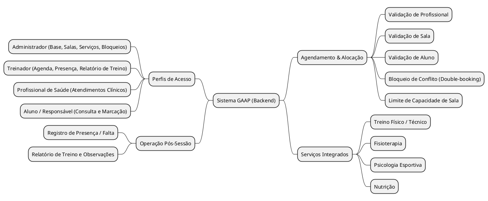

## Introdução

O mapa mental é uma representação visual que organiza ideias, conceitos e fluxos do sistema, facilitando a compreensão da arquitetura e das relações entre os requisitos elicitados no projeto GAAP (Gestão de Atletas de Alta Performance).

## Metodologia

Os mapas mentais foram construídos a partir da análise de domínio descrita em <code>pesquisa.md</code> e dos requisitos elicitados em <code>Brainstorm.md</code>. A modelagem foi desenvolvida utilizando a notação de <i>mindmap</i> do PlantUML, com código-fonte versionado em <code>docs/assets/Mapas_Mentais/mm.wsd</code>.

---

## Mapa Mental do Domínio GAAP

Apresenta o núcleo de agendamentos multidisciplinares (Treino, Fisioterapia, Psicologia e Nutrição), os perfis de acesso e as validações de salas e pós-sessão.

---

## Conclusão

Os diagramas oferecem uma visão sintetizada e estruturada do Backend GAAP, alinhando as necessidades de negócio da academia de treinamento esportivo às diretrizes técnicas de modelagem da disciplina.

## Referências

> PlantUML Mindmap Diagram. Disponível em: https://plantuml.com/mindmap-diagram  
> Cenário de Aula: Backend GAAP — Disponível em: `docs/Iniciacao/cenario.md`

## Autor(es)

| Data | Versão | Descrição | Autor(es) |
| :--- | :---: | :--- | :--- |
| 2026.2 | 1.0 | Criação dos mapas mentais | Arthur Calebe, Antonio Reuter, Pedro Henrique Becker e Breno Huf |
| 2026.2 | 2.0 | Atualização para o modelo oficial do GAAP e serviços multidisciplinares | Arthur Calebe, Antonio Reuter, Pedro Henrique Becker e Breno Huf |
