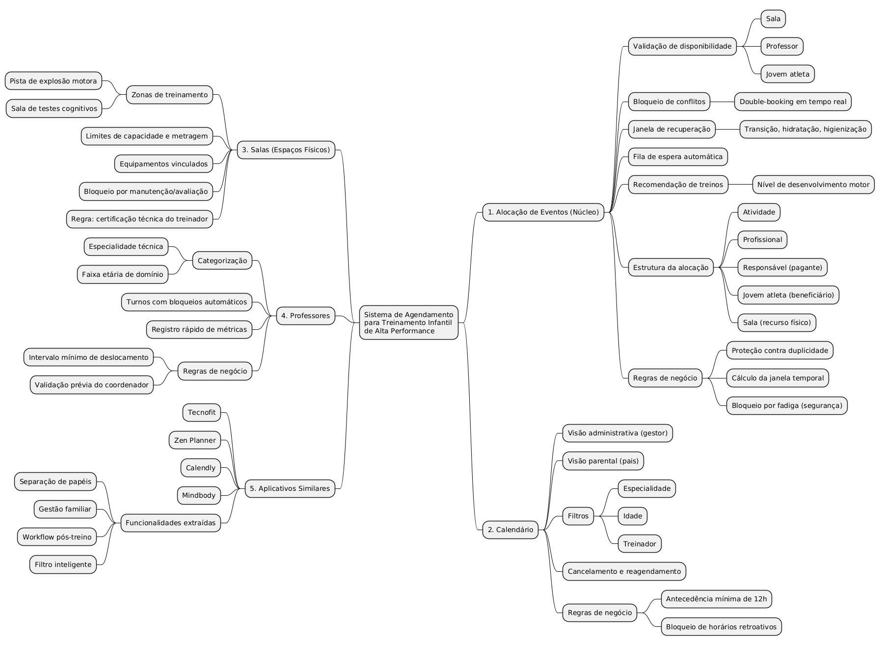
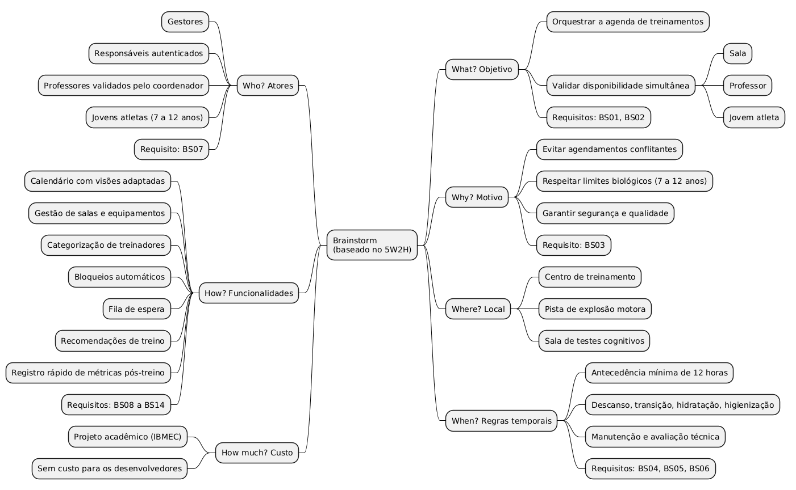

## Introdução

Mapa mental consiste em criar resumos cheios de símbolos, cores, setas e frases de efeito com o objetivo de organizar o conteúdo e facilitar associações entre as informações destacadas. Esse material é muito indicado para pessoas que têm facilidade de aprender de forma visual.

## Metodologia

Os mapas mentais foram construídos a partir dos documentos já produzidos pela equipe: a <code>pesquisa.md</code> (análise de aplicações de alocação de eventos, calendário, salas, professores e plataformas similares) e o <code>Brainstorm.md</code> (perguntas organizadas segundo o 5W2H e os requisitos elicitados BS01 a BS14). Os diagramas foram desenhados com a notação de mindmap do PlantUML e exportados como imagem para este documento. O código-fonte dos dois mapas está versionado em <code>docs/assets/Mapas_Mentais/mm.wsd</code>, permitindo que a equipe reedite e reexporte os diagramas quando o escopo evoluir.

## Mapa mental - Geral

## Versão 1.0

### Mapa mental 1 - Pesquisa

Organiza o núcleo de alocação de eventos e as três frentes levantadas na pesquisa (calendário, salas e professores), além do comparativo com os aplicativos similares (Tecnofit, Zen Planner, Calendly e Mindbody).

### Mapa mental 2 - Brainstorm

Organiza as seis perguntas do Brainstorm (What, Why, Where, When, Who e How, além do How much) e associa cada uma aos requisitos elicitados BS01 a BS14.

## Conclusão

Os mapas mentais deram uma visão geral do sistema de agendamento para treinamento infantil de alta performance, conectando a pesquisa sobre alocação de eventos, calendário, salas e professores às perguntas do 5W2H e aos requisitos elicitados no Brainstorm (BS01 a BS14). Esses diagramas servem de base para as próximas etapas de elicitação, como o Design Thinking e o levantamento de requisitos.

## Referências

> PlantUML Mindmap Diagram. Disponível em: https://plantuml.com/mindmap-diagram

> `pesquisa.md` e `Brainstorm.md` - documentos internos do projeto, pasta `docs/Iniciacao`.

> `mm.wsd` - código-fonte dos mapas mentais, pasta `docs/assets/Mapas_Mentais`.

## Autor(es)
| Data | Versão | Descrição | Autor(es) |
| -- | -- | -- | -- |
| 2026.2 | 1.0 | Criação dos mapas mentais de Pesquisa e Brainstorm do sistema de agendamento para treinamento infantil de alta performance | Arthur Calebe, Antonio Reuter, Pedro Henrique e Breno Ruf |
