# **Protótipo de Baixa Fidelidade — Sistema de Gestão de Treinos**

**Sistema:** Sistema de Gestão de Treinos para Jovens Atletas

## Introdução

Este documento apresenta o protótipo de baixa fidelidade do sistema de gestão de treinos para jovens atletas de 7 a 12 anos. O protótipo tem como objetivo representar, de forma simplificada, as principais telas, informações e caminhos de navegação disponíveis para o responsável pelo atleta.

A prototipagem está diretamente relacionada aos casos de uso definidos para o sistema, principalmente cadastro de responsáveis, cadastro de atletas, agendamento de treinos, calendário, cancelamento e reagendamento, fila de espera e acompanhamento do desenvolvimento do atleta.

O protótipo utiliza **PlantUML** para representar as telas de maneira simples, priorizando a estrutura, os campos, os botões e o fluxo de navegação, sem preocupação com cores, identidade visual ou elementos gráficos de alta fidelidade.

---

## 1. Objetivo

O objetivo do protótipo é representar a estrutura básica da interface do sistema antes da implementação, permitindo visualizar:

* As principais telas do sistema;
* Os campos e informações apresentados ao usuário;
* As ações disponíveis em cada tela;
* A navegação entre as funcionalidades;
* O fluxo necessário para realizar as principais operações do sistema.

O protótipo busca apoiar a validação da experiência do responsável antes da implementação definitiva da interface.

---

## 2. Escopo do Protótipo

O protótipo contempla as principais funcionalidades destinadas ao responsável:

* Login;
* Cadastro de responsável;
* Recuperação de senha;
* Painel principal;
* Visualização dos atletas;
* Cadastro de atleta;
* Visualização do perfil do atleta;
* Agendamento de treino;
* Verificação de disponibilidade;
* Calendário de treinos;
* Cancelamento de treino;
* Reagendamento;
* Fila de espera;
* Relatórios e acompanhamento;
* Perfil do responsável.

O sistema também possui funcionalidades administrativas e relacionadas aos professores, salas e equipamentos, porém estas não são representadas detalhadamente neste protótipo, que prioriza o fluxo principal do responsável.

---

## 3. Telas Prototipadas

### 3.1 Login

A tela de login permite que o responsável informe suas credenciais para acessar o sistema.

Elementos principais:

* E-mail;
* Senha;
* Botão de entrada;
* Recuperação de senha;
* Criação de uma nova conta.

---

### 3.2 Cadastro do Responsável

Tela destinada ao cadastro de um novo responsável no sistema.

Elementos principais:

* Nome completo;
* E-mail;
* Senha;
* Confirmação da senha;
* Telefone;
* Botão de cadastro;
* Botão de cancelamento.

O cadastro de responsável faz parte do fluxo de criação de contas previsto no sistema.

---

### 3.3 Recuperação de Senha

Permite que o responsável solicite a recuperação de acesso à conta.

Elementos principais:

* Campo de e-mail;
* Botão para envio do link;
* Retorno para a tela de login.

---

### 3.4 Painel Principal

Após o login, o responsável é direcionado para o painel principal.

O painel apresenta um resumo das informações relevantes e permite acessar:

* Meus atletas;
* Agenda;
* Relatórios;
* Fila de espera;
* Perfil;
* Encerramento da sessão.

---

### 3.5 Meus Atletas

Tela responsável pela visualização dos atletas vinculados à conta do responsável.

Cada atleta apresenta informações básicas, como:

* Nome;
* Idade;
* Nível de desenvolvimento;
* Status;
* Acesso ao perfil;
* Opção de agendamento de treino.

Também existe a opção de cadastrar um novo atleta.

O cadastro de atleta exige que o responsável esteja autenticado e permite informar nome, idade, nível de desenvolvimento e outras informações básicas.

---

### 3.6 Cadastro de Atleta

Tela utilizada para cadastrar um novo atleta vinculado ao responsável.

Campos principais:

* Nome;
* Idade;
* Nível de desenvolvimento;
* Informações adicionais;
* Botão para salvar;
* Botão para cancelar.

O sistema deve validar as informações antes de concluir o cadastro.

---

### 3.7 Perfil do Atleta

Apresenta as informações detalhadas do atleta selecionado.

São apresentados:

* Dados pessoais básicos;
* Nível de desenvolvimento;
* Histórico de treinos;
* Estado de recuperação;
* Opção de agendamento;
* Opção de visualização dos relatórios.

---

### 3.8 Agendamento de Treino

Tela utilizada para realizar o agendamento de um treinamento.

Campos principais:

* Atleta;
* Tipo de treino;
* Data;
* Horário;
* Professor;
* Sala.

O sistema também apresenta informações sobre:

* Disponibilidade do atleta;
* Disponibilidade do professor;
* Disponibilidade da sala;
* Período de descanso e recuperação.

O agendamento somente deve ser confirmado após a validação simultânea das disponibilidades. O caso de uso também prevê bloqueio quando houver conflito de agenda, período de recuperação ou tentativa de agendamento fora da antecedência mínima estabelecida.

---

### 3.9 Calendário de Treinos

O calendário apresenta os treinamentos programados para os atletas vinculados ao responsável.

A tela apresenta:

* Calendário;
* Treinos agendados;
* Horários disponíveis;
* Períodos de recuperação;
* Horários bloqueados;
* Informações do treino selecionado.

Também são disponibilizadas as opções de:

* Cancelar treino;
* Reagendar treino.

O responsável pode visualizar a rotina, o histórico e as próximas atividades dos atletas vinculados.

---

### 3.10 Reagendamento

Permite alterar os dados de um treino já agendado.

São apresentados:

* Dados do treino atual;
* Nova data;
* Novo horário;
* Novo professor;
* Nova sala;
* Confirmação do reagendamento.

O sistema deve verificar novamente as regras de disponibilidade antes de confirmar a alteração.

---

### 3.11 Fila de Espera

A tela apresenta os alunos que aguardam uma vaga em determinado treino.

São exibidos:

* Treino desejado;
* Posição na fila;
* Responsáveis/alunos aguardando;
* Notificação de disponibilidade;
* Confirmação da vaga;
* Opção de sair da fila.

O sistema deve selecionar o próximo aluno conforme a ordem e compatibilidade e notificar o responsável quando surgir uma vaga.

---

### 3.12 Relatórios e Acompanhamento

Tela destinada ao acompanhamento do desenvolvimento do atleta.

São apresentados indicadores como:

* Quantidade de treinos realizados;
* Presença;
* Intensidade média;
* Recuperação;
* Histórico de desempenho;
* Evolução do atleta.

Os dados são utilizados para auxiliar o acompanhamento e as decisões relacionadas aos próximos treinamentos.

---

## 4. Código PlantUML

O protótipo foi desenvolvido utilizando a linguagem **PlantUML**.

```plantuml
@startuml

title Prototipo de Baixa Fidelidade - Sistema de Gestao de Treinos

frame "LOGIN" {

  rectangle "SISTEMA DE GESTAO DE TREINOS" as Titulo

  rectangle "E-mail\n\n____________________________" as Email

  rectangle "Senha\n\n____________________________" as Senha

  rectangle "[ ENTRAR ]" as Entrar

  rectangle "[ ESQUECI MINHA SENHA ]" as Recuperar

  rectangle "[ CRIAR CONTA ]" as Criar
}


frame "CADASTRO DO RESPONSAVEL" {

  rectangle "CADASTRO" as TituloCadastro

  rectangle "Nome completo\n\n____________________________" as NomeResponsavel

  rectangle "E-mail\n\n____________________________" as EmailCadastro

  rectangle "Senha\n\n____________________________" as SenhaCadastro

  rectangle "Confirmar senha\n\n____________________________" as ConfirmarSenha

  rectangle "Telefone\n\n____________________________" as Telefone

  rectangle "[ CADASTRAR ]" as CadastrarResponsavel

  rectangle "[ CANCELAR ]" as CancelarCadastro
}


frame "RECUPERAR SENHA" {

  rectangle "RECUPERACAO DE SENHA" as TituloRecuperacao

  rectangle "Informe seu e-mail\n\n____________________________" as EmailRecuperacao

  rectangle "[ ENVIAR LINK ]" as EnviarLink

  rectangle "[ VOLTAR PARA LOGIN ]" as VoltarLogin
}


frame "PAINEL PRINCIPAL" {

  rectangle "OLA, RESPONSAVEL!" as Ola

  rectangle "RESUMO\n\nAtletas cadastrados: 2\nTreinos esta semana: 4\nProximo treino: 25/09 - 15:00" as Resumo

  rectangle "[ MEUS ATLETAS ]" as BtnAtletas

  rectangle "[ AGENDA ]" as BtnAgenda

  rectangle "[ RELATORIOS ]" as BtnRelatorios

  rectangle "[ FILA DE ESPERA ]" as BtnFila

  rectangle "[ PERFIL ]" as BtnPerfil

  rectangle "[ SAIR ]" as BtnSair
}


frame "MEUS ATLETAS" {

  rectangle "MEUS ATLETAS" as TituloAtletas

  rectangle "JOAO SILVA\n\nIdade: 10 anos\nNivel: Intermediario\nStatus: Ativo" as Atleta1

  rectangle "[ VER PERFIL ]" as Perfil1

  rectangle "[ AGENDAR TREINO ]" as Agendar1

  rectangle "MARIA SILVA\n\nIdade: 8 anos\nNivel: Iniciante\nStatus: Ativo" as Atleta2

  rectangle "[ VER PERFIL ]" as Perfil2

  rectangle "[ AGENDAR TREINO ]" as Agendar2

  rectangle "[ + CADASTRAR ATLETA ]" as NovoAtleta
}


frame "CADASTRAR ATLETA" {

  rectangle "CADASTRO DO ATLETA" as TituloAtleta

  rectangle "Nome\n\n____________________________" as NomeAtleta

  rectangle "Idade\n\n____________________________" as IdadeAtleta

  rectangle "Nivel de desenvolvimento\n\n[ SELECIONAR ]" as NivelAtleta

  rectangle "Informacoes basicas\n\n____________________________\n____________________________" as InfoAtleta

  rectangle "[ SALVAR ATLETA ]" as SalvarAtleta

  rectangle "[ CANCELAR ]" as CancelarAtleta
}


frame "PERFIL DO ATLETA" {

  rectangle "PERFIL - JOAO SILVA" as TituloPerfilAtleta

  rectangle "Idade: 10 anos\nNivel: Intermediario\nResponsavel: Responsavel\nStatus: Ativo" as DadosAtleta

  rectangle "ULTIMOS TREINOS\n\n19/09 - Futebol - Realizado\n17/09 - Tecnica - Realizado\n15/09 - Fisico - Realizado" as UltimosTreinos

  rectangle "RECUPERACAO\n\nEstado atual: Normal\nProximo periodo de descanso: 24 horas" as Recuperacao

  rectangle "[ AGENDAR TREINO ]" as AgendarPerfil

  rectangle "[ VER RELATORIOS ]" as RelatorioPerfil
}


frame "AGENDAR TREINO" {

  rectangle "AGENDAR TREINO" as TituloAgendamento

  rectangle "Atleta:\n[ JOAO SILVA ]" as CampoAtleta

  rectangle "Tipo de treino:\n[ FUTEBOL ]" as CampoTipo

  rectangle "Data:\n[ 25/09/2026 ]" as CampoData

  rectangle "Horario:\n[ 15:00 ]" as CampoHorario

  rectangle "Professor:\n[ CARLOS ]" as CampoProfessor

  rectangle "Sala:\n[ SALA 02 ]" as CampoSala

  rectangle "DISPONIBILIDADE\n\nAtleta: DISPONIVEL\nProfessor: DISPONIVEL\nSala: DISPONIVEL" as Disponibilidade

  rectangle "RECUPERACAO\n\nDescanso necessario: OK\nSem conflito de recuperacao" as VerificacaoRecuperacao

  rectangle "[ CONFIRMAR AGENDAMENTO ]" as Confirmar

  rectangle "[ CANCELAR ]" as Cancelar
}


frame "CALENDARIO DE TREINOS" {

  rectangle "CALENDARIO - SETEMBRO 2026\n\nSEG  TER  QUA  QUI  SEX  SAB  DOM\n21   22   23   24   25   26   27\n\n28   29   30" as Calendario

  rectangle "LEGENDA\n\n[T] Treino agendado\n[D] Horario disponivel\n[R] Periodo de recuperacao\n[B] Horario bloqueado" as Legenda

  rectangle "TREINO SELECIONADO\n\n25/09/2026\nFutebol\n15:00\nProfessor Carlos\nSala 02" as TreinoSelecionado

  rectangle "[ CANCELAR TREINO ]" as CancelarTreino

  rectangle "[ REAGENDAR ]" as Reagendar
}


frame "REAGENDAR TREINO" {

  rectangle "TREINO ATUAL\n\n25/09/2026 - 15:00\nFutebol\nProfessor Carlos\nSala 02" as TreinoAtual

  rectangle "NOVA DATA\n\n[ 27/09/2026 ]" as NovaData

  rectangle "NOVO HORARIO\n\n[ 10:00 ]" as NovoHorario

  rectangle "NOVO PROFESSOR\n\n[ SELECIONAR ]" as NovoProfessor

  rectangle "NOVA SALA\n\n[ SELECIONAR ]" as NovaSala

  rectangle "[ CONFIRMAR REAGENDAMENTO ]" as ConfirmarReagendamento

  rectangle "[ CANCELAR ]" as CancelarReagendamento
}


frame "FILA DE ESPERA" {

  rectangle "FILA DE ESPERA" as TituloFila

  rectangle "TREINO\n\nFutebol - 25/09 - 15:00\nSala 02\nProfessor Carlos" as TreinoFila

  rectangle "POSICAO NA FILA\n\n1 - Pedro Silva\n2 - Maria Souza\n3 - Lucas Santos" as PosicaoFila

  rectangle "NOTIFICACAO\n\nExiste uma vaga disponivel.\nO primeiro responsavel sera notificado." as NotificacaoFila

  rectangle "[ CONFIRMAR VAGA ]" as ConfirmarVaga

  rectangle "[ SAIR DA FILA ]" as SairFila
}


frame "RELATORIOS E ACOMPANHAMENTO" {

  rectangle "ATLETA\n\n[ JOAO SILVA ]" as SelecaoAtleta

  rectangle "INDICADORES\n\nTreinos realizados: 18\nPresenca: 92 por cento\nIntensidade media: 7 de 10\nRecuperacao: Boa" as Indicadores

  rectangle "HISTORICO\n\n05/09 - Intensidade 6 de 10\n12/09 - Intensidade 7 de 10\n19/09 - Intensidade 8 de 10" as Historico

  rectangle "ACOMPANHAMENTO\n\nDesempenho: Evolucao\nFadiga: Normal\nRecuperacao: Adequada" as Acompanhamento

  rectangle "[ VER DETALHES ]" as DetalhesRelatorio
}


frame "PERFIL DO RESPONSAVEL" {

  rectangle "MEU PERFIL" as TituloPerfil

  rectangle "Nome\nResponsavel" as PerfilNome

  rectangle "E-mail\nresponsavel@email.com" as PerfilEmail

  rectangle "Telefone\n(21) 99999-9999" as PerfilTelefone

  rectangle "[ EDITAR DADOS ]" as EditarPerfil

  rectangle "[ ALTERAR SENHA ]" as AlterarSenha
}


' NAVEGACAO

Entrar --> BtnAtletas : Login

Criar --> CadastrarResponsavel : Criar conta

CadastrarResponsavel --> Entrar : Cadastro concluido

Recuperar --> EmailRecuperacao : Recuperar senha

EnviarLink --> VoltarLogin : Link enviado

VoltarLogin --> Entrar : Voltar

BtnAtletas --> Atleta1 : Meus atletas

BtnAgenda --> Calendario : Agenda

BtnRelatorios --> SelecaoAtleta : Relatorios

BtnFila --> TituloFila : Fila de espera

BtnPerfil --> TituloPerfil : Perfil

BtnSair --> Entrar : Sair

NovoAtleta --> NomeAtleta : Cadastrar atleta

SalvarAtleta --> Atleta1 : Cadastro concluido

Perfil1 --> DadosAtleta : Ver perfil

Perfil2 --> DadosAtleta : Ver perfil

Agendar1 --> CampoAtleta : Agendar treino

Agendar2 --> CampoAtleta : Agendar treino

AgendarPerfil --> CampoAtleta : Agendar treino

RelatorioPerfil --> SelecaoAtleta : Ver relatorios

Confirmar --> Calendario : Agendamento confirmado

Cancelar --> Atleta1 : Cancelar

Reagendar --> TreinoAtual : Reagendar treino

ConfirmarReagendamento --> Calendario : Alteracao confirmada

CancelarReagendamento --> Calendario : Cancelar

CancelarTreino --> Calendario : Treino cancelado

ConfirmarVaga --> Calendario : Vaga confirmada

SairFila --> TituloFila : Remover da fila

EditarPerfil --> PerfilNome : Editar dados

@enduml
```



---

## 5. Fluxo Principal do Protótipo

O fluxo principal representado pelo protótipo pode ser resumido da seguinte forma:

```text
LOGIN
  |
  v
PAINEL PRINCIPAL
  |
  +--------------------+
  |                    |
  v                    v
MEUS ATLETAS         AGENDA
  |                    |
  v                    v
PERFIL DO ATLETA     CALENDARIO
  |                    |
  v                    +----> REAGENDAR
AGENDAR TREINO             |
  |                        v
  +--------------------> CALENDARIO
```

O fluxo permite que o responsável acesse seus atletas, selecione um atleta, consulte sua situação e realize um agendamento. O sistema verifica a disponibilidade do atleta, professor e sala antes da confirmação.

---

## 6. Telas e Funcionalidades

| Tela                    | Principais funcionalidades                                 |
| ----------------------- | ---------------------------------------------------------- |
| Login                   | Entrada no sistema                                         |
| Cadastro do Responsável | Criação de conta                                           |
| Recuperar Senha         | Recuperação de acesso                                      |
| Painel Principal        | Acesso às principais funções                               |
| Meus Atletas            | Visualização dos atletas vinculados                        |
| Cadastrar Atleta        | Cadastro de novo atleta                                    |
| Perfil do Atleta        | Dados e histórico do atleta                                |
| Agendar Treino          | Seleção de atleta, treino, professor, sala, data e horário |
| Calendário              | Visualização da rotina e dos treinos                       |
| Reagendar Treino        | Alteração de data e horário                                |
| Fila de Espera          | Controle das vagas disponíveis                             |
| Relatórios              | Acompanhamento do desenvolvimento                          |
| Perfil do Responsável   | Alteração dos dados da conta                               |

---

## 7. Características de Baixa Fidelidade

O protótipo não representa a interface visual definitiva do sistema. Por isso, foram utilizados elementos gráficos simples, como:

* Retângulos;
* Campos de texto;
* Botões;
* Informações textuais;
* Conexões de navegação.

Não foram definidos nesta etapa:

* Cores finais;
* Logotipo;
* Tipografia definitiva;
* Ícones finais;
* Imagens;
* Animações;
* Layout visual definitivo.

O objetivo é validar a **estrutura e o fluxo de navegação** antes da implementação da interface final.

---

## 8. Como Visualizar

O código PlantUML pode ser visualizado utilizando ferramentas compatíveis com a linguagem, como:

* **PlantText**;
* **VS Code** com extensão PlantUML;
* Outras ferramentas compatíveis com PlantUML.

O arquivo deve ser salvo com a extensão:

```text
prototipo-baixa-fidelidade.puml
```

O arquivo `.puml` deve ser mantido no repositório junto aos demais artefatos do projeto para permitir a edição e evolução do protótipo.

---

## 9. Relação com os Casos de Uso

O protótipo foi construído com base nos principais casos de uso definidos para o sistema.

| Caso de Uso                       | Tela relacionada            |
| --------------------------------- | --------------------------- |
| Cadastro de responsável           | Cadastro do Responsável     |
| Entrada no sistema                | Login                       |
| Recuperação de senha              | Recuperar Senha             |
| Cadastro de atleta                | Cadastrar Atleta            |
| Agendamento de treino             | Agendar Treino              |
| Cancelamento de treino            | Calendário                  |
| Reagendamento                     | Reagendar Treino            |
| Visualização de calendário        | Calendário de Treinos       |
| Gerenciamento da fila de espera   | Fila de Espera              |
| Acompanhamento do desenvolvimento | Relatórios e Acompanhamento |

O protótipo, portanto, funciona como uma representação visual preliminar das funcionalidades descritas nos casos de uso do sistema.

---

## 10. Conclusão

A prototipagem de baixa fidelidade permite visualizar antecipadamente a organização das principais funcionalidades do sistema de gestão de treinos.

A estrutura proposta prioriza o fluxo do responsável, desde o acesso ao sistema até o cadastro e acompanhamento dos atletas, incluindo as operações de agendamento, cancelamento, reagendamento e controle da fila de espera.

Por ser uma representação de baixa fidelidade, o protótipo pode ser posteriormente refinado para uma interface de maior fidelidade, mantendo como base os fluxos e requisitos já definidos para o sistema.
