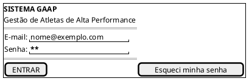
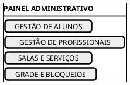
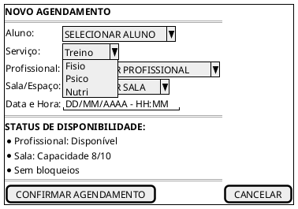
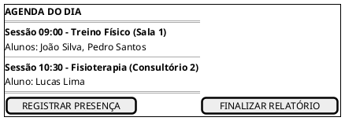
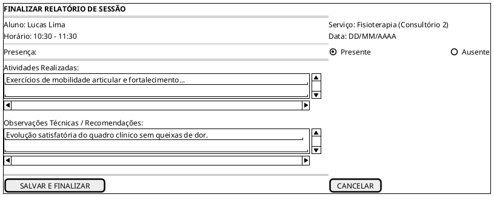

# Protótipo de Baixa Fidelidade — Sistema GAAP

## Introdução

A construção do protótipo de baixa fidelidade auxilia a equipe de desenvolvimento a detalhar os requisitos, validar os fluxos operacionais e mapear os componentes visuais essenciais do sistema GAAP (Gestão de Atletas de Alta Performance). Com o protótipo, estabelece-se a interface entre os atores e o sistema para os serviços de <b>Treino</b>, <b>Fisioterapia</b>, <b>Psicologia</b> e <b>Nutrição</b>.

## Metodologia

A equipe utilizou a linguagem de modelagem de interfaces <b>PlantUML Salt</b> para construir wireframes conceituais de baixa fidelidade, representando campos de entrada, listas de seleção, botões de ação e painéis de controle para os fluxos centrais da aplicação.

---

## Telas do Sistema

### 1. Tela de Login

Permite a autenticação segura de Administradores, Treinadores, Profissionais de Saúde e Alunos/Responsáveis, direcionando cada usuário para o painel correspondente ao seu perfil de acesso (RBAC).

---

### 2. Painel Administrativo

Painel central do Administrador para acesso rápido aos cadastros de base, gestão de alunos e profissionais, configuração de salas e serviços e controle da grade de horários e bloqueios operacionais (RF-03 a RF-10).

---

### 3. Tela de Novo Agendamento

Interface para agendamento de sessões com exibição do <b>Status de Disponibilidade em tempo real</b>, refletindo a validação simultânea de horários livres, lotação da sala e ausência de bloqueios administrativos (RN-01, RN-02, RN-03 e UC-06).

---

### 4. Agenda do Dia

Visão operacional diária para Treinadores e Profissionais de Saúde (Fisioterapia, Psicologia e Nutrição), permitindo consultar as sessões atribuídas e acionar o registro de presença ou fechamento de relatórios.

---

### 5. Finalizar Relatório de Treino / Atendimento

Tela de finalização de sessão onde o profissional responsável registra a confirmação de presença do atleta e redige o relatório técnico de atividades e observações clínicas (UC-10, RF-17, RF-18, RN-05 e RN-06).

---

## Conclusão

Os protótipos de baixa fidelidade elaborados em PlantUML Salt consolidam visualmente a arquitetura de informação do sistema GAAP. As telas garantem rastreabilidade direta com os Casos de Uso prioritários (UC-06 e UC-10), com os Requisitos Funcionais e com os Diagramas de Sequência da fase de Elaboração.

## Referências

> PlantUML Salt (Graphical Interface). Disponível em: <https://plantuml.com/salt>.  
> BARBOSA, S. D. J.; SILVA, B. S. *Interação Humano-Computador*. Elsevier, 2010.

## Autor(es)

| Data | Versão | Descrição | Autor(es) |
| :---: | :---: | :--- | :--- |
| 2026.2 | 1.0 | Criação inicial do protótipo | Arthur Calebe, Antonio Reuther, Pedro Henrique Becker e Breno Huf |
| 2026.2 | 2.0 | Implementação dos wireframes em PlantUML Salt com as 4 telas centrais e tela de relatório | Arthur Calebe, Antonio Reuther, Pedro Henrique Becker e Breno Huf |
