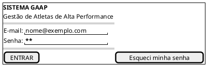
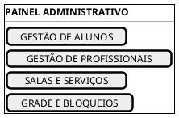
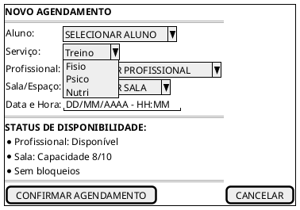
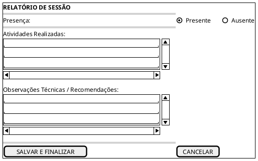

# Protótipo de Baixa Fidelidade — Sistema GAAP

## Introdução

Este documento apresenta o protótipo conceitual de baixa fidelidade do sistema GAAP (Gestão de Atletas de Alta Performance). O protótipo utiliza <b>PlantUML</b> para representar os fluxos essenciais de navegação, campos e ações disponíveis para Administradores, Treinadores/Profissionais de Saúde e Alunos/Responsáveis, cobrindo os quatro serviços centrais: <b>Treino</b>, <b>Fisioterapia</b>, <b>Psicologia</b> e <b>Nutrição</b>.

---

## 1. Escopo das Telas Prototipadas

* **Autenticação**: Login e recuperação de acesso.
* **Painel do Administrador**: Gestão de Alunos, Profissionais, Serviços, Salas e Bloqueios.
* **Painel do Treinador / Profissional de Saúde**: Agenda do dia, registro de presença/falta e elaboração de relatório de treino/atendimento.
* **Painel do Aluno / Responsável**: Consulta de horários, solicitação de agendamento e visualização do histórico.

---

## 2. Diagrama de Telas e Navegação em PlantUML

---

## 3. Conclusão

O protótipo de baixa fidelidade consolida o fluxo das operações fundamentais do sistema GAAP, garantindo aderência aos casos de uso prioritários de agendamento, validação de capacidade e registro operacional.

## Autor(es)

| Data | Versão | Descrição | Autor(es) |
| :--- | :---: | :--- | :--- |
| 2026.2 | 1.0 | Versão inicial | Breno Huf |
| 2026.2 | 2.0 | Atualização para os fluxos reais do Backend GAAP (Admin, Treinador, Saúde e Aluno) | Arthur Calebe, Antonio Reuther, Pedro Henrique Becker e Breno Huf |
